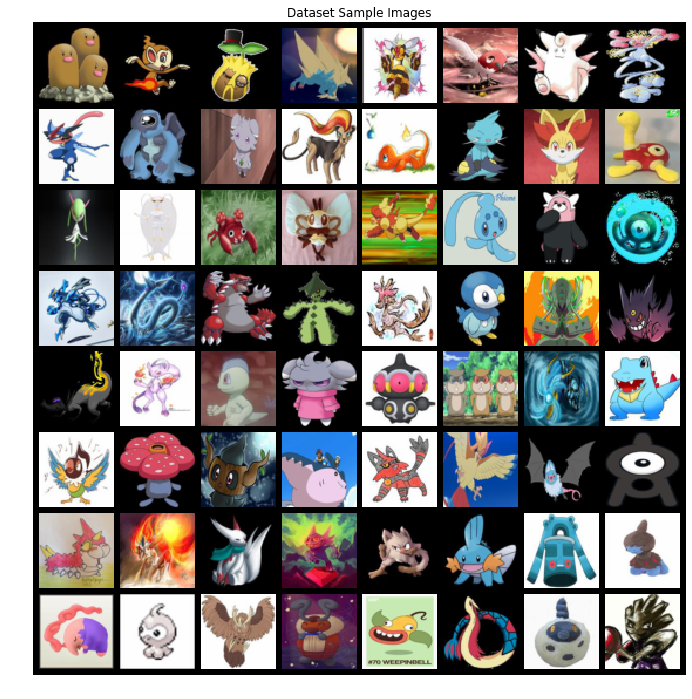
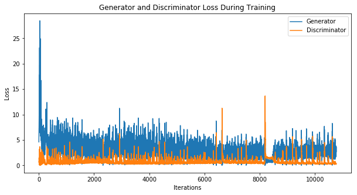
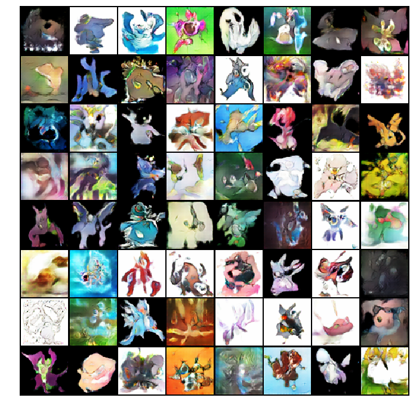

<h1 align="center"> PokeGAN </h1>

A simple implementation of DCGAN on the Pokémon Dataset. Get new Pokémon ideas, for the next region!

 

 

### Input Image

### Loss generated

### Output Image

This project was done to explain an application of GANs in the "Introduction to GANs and VAEs" event by [SMLRA-KJSCE](https://github.com/smlra-kjsce).
